# 🧠 brain.AI

A multi-agent AI system that maps human brain regions to autonomous
agents running in parallel to simulate how the brain makes decisions.

Every region has a job. Every agent has an output.
They compete, conflict, and converge — just like the real thing.

---

## Architecture



### Limbic System — fast, emotional

| Agent             | Brain Region      | Role                                          |
| ----------------- | ----------------- | --------------------------------------------- |
| Amygdala          | Amygdala          | Threat detection + emotional salience scoring |
| Cingulate         | Cingulate cortex  | Emotional conflict + tension monitoring       |
| Hippocampus       | Hippocampus       | Memory store + episodic retrieval (vector DB) |
| Hypothalamus      | Hypothalamus      | Internal state + resource pressure            |
| Nucleus Accumbens | Nucleus accumbens | Reward evaluation + motivation scoring        |

### Cerebral Cortex — slow, rational

| Agent         | Brain Region              | Role                                    |
| ------------- | ------------------------- | --------------------------------------- |
| Dorsolateral  | Dorsolateral PFC          | Working memory + step-by-step reasoning |
| Ventromedial  | Ventromedial PFC          | Value comparison + judgment             |
| Orbitofrontal | Orbitofrontal cortex      | Consequence evaluation                  |
| Parietal      | Parietal cortex           | Numerical + logical estimation          |
| Prefrontal    | Prefrontal cortex         | Goal-directed planning                  |
| ACC           | Anterior cingulate cortex | Error detection + conflict flagging     |

### Integration Layer

Computes limbic vs cortical dominance weights in real time.
Whichever system wins shapes the final response — tone, urgency, reasoning depth.

---

## How it works

```
User input
    ↓
Perception.py — extracts intent, emotional load, urgency
    ↓
┌─────────────────────┬─────────────────────┐
│   Limbic agents     │   Cortex agents     │
│   (parallel)        │   (parallel)        │
└─────────────────────┴─────────────────────┘
    ↓
Integration_layer.py — dominance resolution
    ↓
Decision_output.py — final response + debug panel
```

---

## Sample output

```
🗣️ You: i am having a rough day but i have work pending,
         should i work or sleep?

🧠 Response:
Start with a short 20-minute rest to recharge. Work for
1-2 hours, then reassess. Maintain productivity while
taking care of your well-being.

📊 Debug Panel:
  Dominant System : CORTICAL
  Confidence      : 0.85
  Urgency         : 5/10
  Emotional Tone  : calm / confident
  Amygdala        : Urgency 5 | Salience 6 | Flag: safe
  Cingulate       : Tension 7/10 | Conflict: True ⚠️
  Prefrontal      : Confidence 0.85
  ACC             : Doubt 2/10 | Reloop: False
```

---

## Setup

```bash
git clone https://github.com/vertex-inc/brain.AI
cd brain.AI
pip install -r requirements.txt
```

Create a `.env` file:

```
OPENAI_API_KEY=your_key_here
```

Run:

```bash
python Perception.py
```

---

## Stack

- Python 3.10+
- LangChain + LangChain-OpenAI
- GPT-4o
- Chroma (vector memory)
- asyncio (parallel agent execution)

---

## Roadmap

- [ ] Persistent memory across sessions
- [ ] Dynamic fuel state (session fatigue simulation)
- [ ] Web UI with live agent score dashboard
- [ ] Swap GPT-4o for local Qwen2.5 via Ollama

---

Built by Atharv Munde
